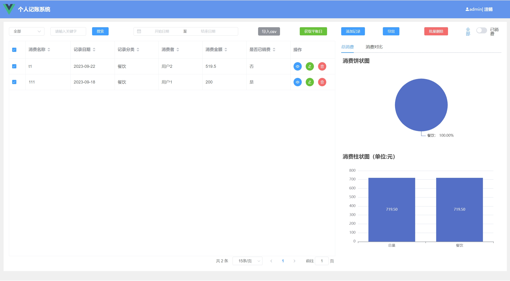
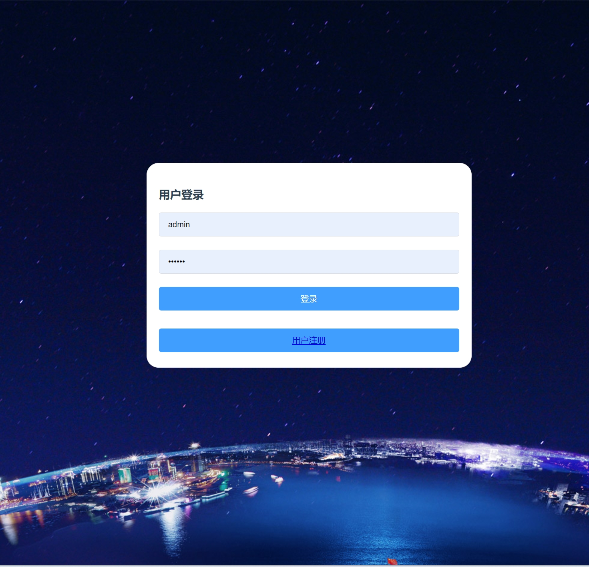
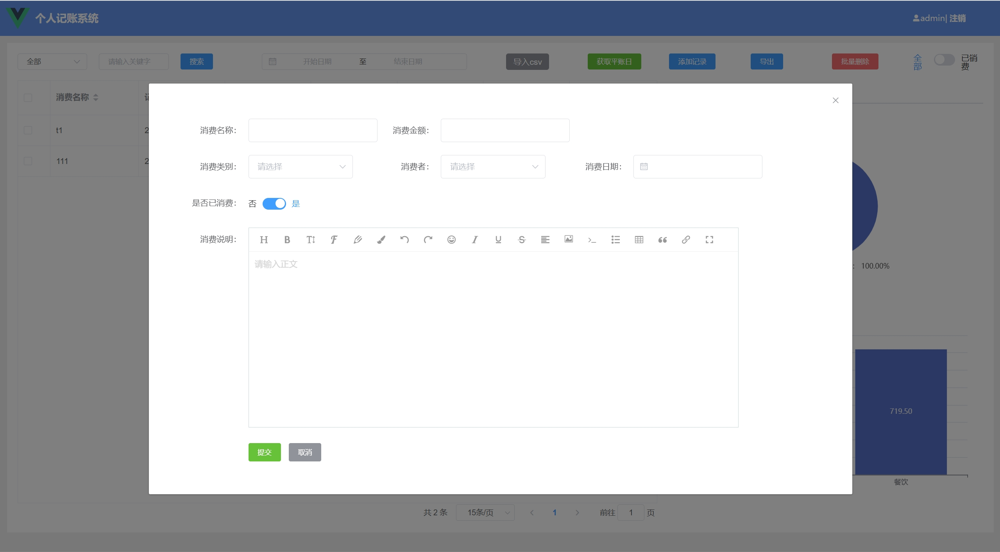
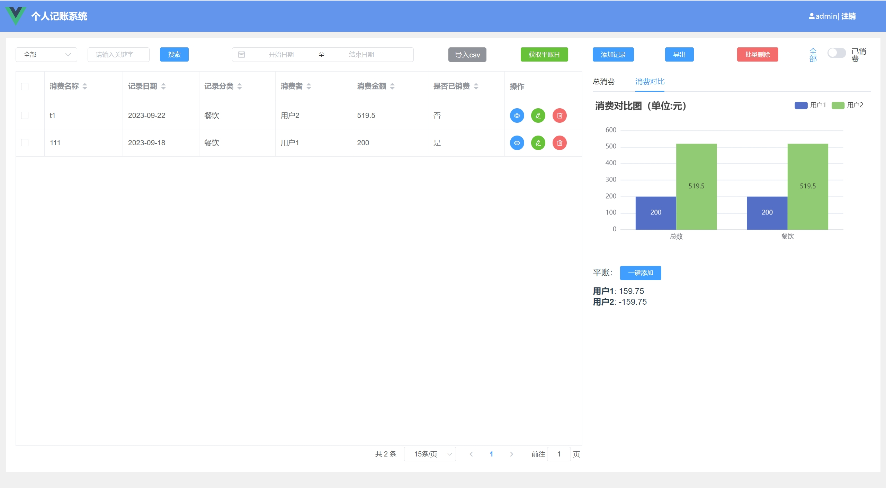
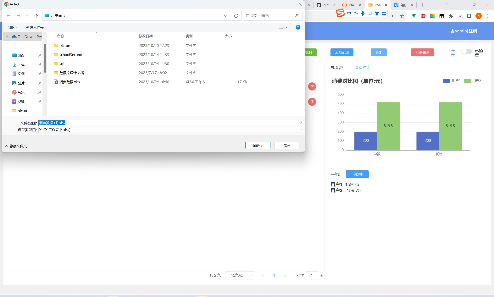
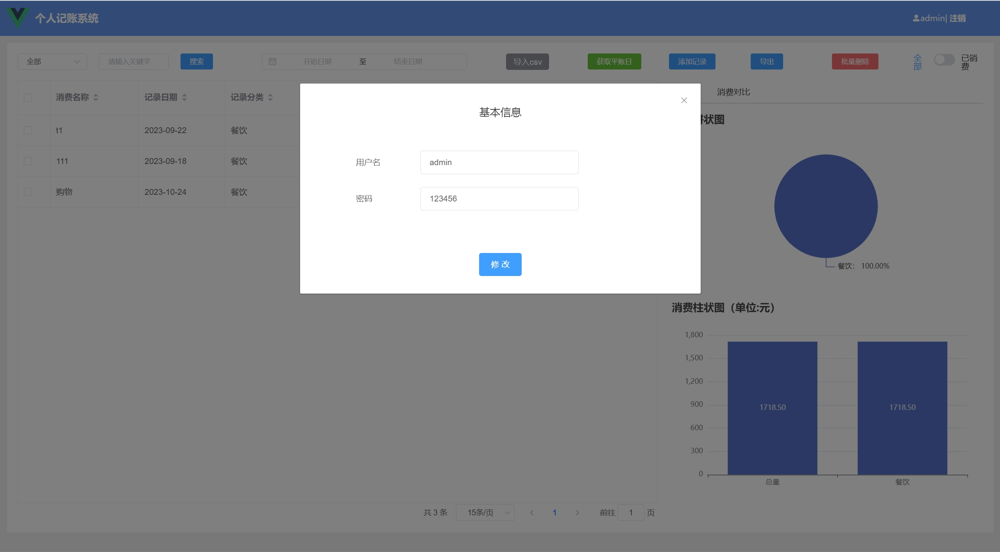

### 作者微信：grapro666 QQ：3642795578 (支持部署调试、支持代做毕设和论文)

### 接javaweb、python、小程序、H5、APP、各种管理系统、单片机、嵌入式等开发

### 选题+开题报告+任务书+程序定制+安装调试+论文+答辩ppt

**博客地址：
[https://blog.csdn.net/2303_76227485/article/details/134017106](https://blog.csdn.net/2303_76227485/article/details/134017106)**

**视频演示：
[https://www.bilibili.com/video/BV1DN411x7A8/](https://www.bilibili.com/video/BV1DN411x7A8/)**

**毕业设计所有选题地址：
[https://github.com/codegitpro/allProject](https://github.com/codegitpro/allProject)**

## 基于Java+Springboot+vue的个人理财管理系统(源码+数据库)102

## 一、系统介绍
本系统前后端分离

管理员功能：
- 登录、注册、添加账单、导出账单、统计分析、个人信息修改、消费对比

## 二、所用技术
后端技术栈：
- Springboot
- SpringMvc
- mybatis
- mysql

前端技术栈：
- Vue
- ElementUI
- vue-router
- axios

## 三、环境介绍
基础环境 :IDEA/eclipse, JDK 1.8, Mysql5.7及以上, Maven3.6, node.js(14版本)

所有项目以及源代码本人均调试运行无问题 可支持远程调试运行

## 四、页面截图
### 1、用户页面

## 五、浏览地址

- 前台访问路径：http://localhost:8080
  账号密码：admin/123456

## 六、安装教程

1. 使用Navicat或者其它工具，在mysql中创建对应名称的数据库，并执行项目的sql

2. 使用IDEA/Eclipse导入server项目，导入时，若为maven项目请选择maven; 等待依赖下载完成

3. 修改resources目录下面application.properties里面的数据库配置

4. com/my/count/CountApplication.java启动后端项目

5. vscode或idea打开webapp项目

6. 在编译器中打开terminal，执行npm install 依赖下载完成后执行 npm run serve,执行成功后会显示前台访问地址

